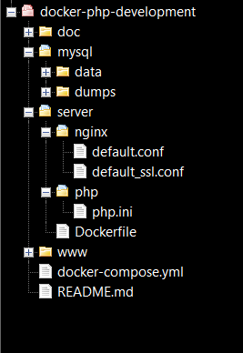
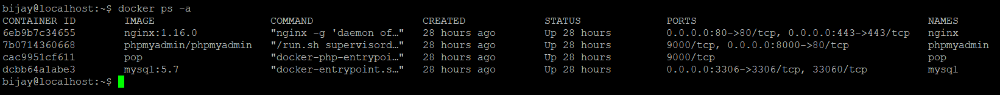

# PHP enviroment setup using Docker
### Using NGINX, PHP-FPM, MySQl, PHPMyAdmin

## Overview

1. [Install prerequisites](#install-prerequisites)

    Before installing project make sure the following prerequisites have been met.

2. [Clone this repository](#clone-this-repository)

    Clone this repository into your server

3. [Install your web project](#install-your-web-project)

    Clone your web project inside

4. [Configure Nginx and PHP config](#configure-nginx-and-php-config)

    Configure the Nginx and PHP config files as per your web project
    
5. [Configure Dockerfile and docker-compose.yml](#configure-dockerfile-and-docker-composeyml)

    Configure the Dockerfile and docker-compose.yml as per your web project

6. [Run your project](#run-your-project)

    Now run the web project using docker commands
    
7. [Generate SSL certificates and setup auto renew](#generate-ssl-certificates-and-setup-auto-renew) [`Optional`]

    Additionally, generate SSL certificates for securing server and setup auto renew

8. [Using docker commands](#using-docker-commands)

    Use these docker commands for recurring operations
___

## Install Prerequisites

These are the required requisties for buildling a PHP enviroment :

* [Git](https://git-scm.com/downloads)

Check if `Git` is installed using the command :

```sh
git --version
```

___

* [Docker](https://docs.docker.com/engine/installation/)

Install `Docker` easily by using this script :

```sh
curl -sSL https://get.docker.com/ | sh
```

Enable `Docker` at startup

```sh
systemctl docker enable
```

Verify `Docker` version :

```sh
docker --version
```

___

* [Docker Compose](https://docs.docker.com/compose/install/)

Install `Docker Compose` using this script :

```sh
sudo curl -L "https://github.com/docker/compose/releases/download/1.23.1/docker-compose-$(uname -s)-$(uname -m)" -o /usr/local/bin/docker-compose
```

Set file permissions :

```sh
sudo chmod +x /usr/local/bin/docker-compose
```

Verify `Docker Compose` version :

```sh
docker-compose --version
```

___

* [Certbot](https://certbot.eff.org/) [`Optional`]

Add the `Certbot` repository :

```sh
sudo add-apt-repository ppa:certbot/certbot
```

Update the package list :

```sh
sudo apt-get update
```

Finally, install `Certbot` package :

```sh
sudo apt-get install certbot
```

___

### Docker Image to use

* [Nginx](https://hub.docker.com/_/nginx/)
* [PHP-FPM](https://hub.docker.com/r/nanoninja/php-fpm/)
* [MySQL](https://hub.docker.com/_/mysql/)
* [PHPMyAdmin](https://hub.docker.com/r/phpmyadmin/phpmyadmin/)


This project uses the following ports :

| Server     | Port |
|------------|------|
| Nginx      | 80   |
| Nginx SSL  | 443  |
| MySql      | 3306 |
| PHPMyAdmin | 8000 |

___

## Clone this repository

Git clone this repository into your server :

```sh
git clone https://sakwo.sastodeal.com/bijay135/php-ci-cd
```

Go to the project directory :

```sh
cd php-ci-cd
```

### Repository Tree Structure



___

## Install your web project

After moving inside the repository root directory. Move inside `www` folder :

```sh
cd www
```

Now `Git` clone your web project inside it :

```sh
git clone https://your_project_link
```

Change your `database` configuration. Use `mysql` as hostname to connect via a container

Change the `base_url` of your project to `/` since `Nginx` manages the `web_root` configuration

Now your project has been installed and configured to use this repository successfully

___

## Configure Nginx and PHP config

Open the Nginx config using `Vim` editor :

```sh
sudo vi server/nginx/default.conf
```

```sh
# Nginx configuration

server {
	listen 80;
	server_name host_name.com www.host_name.com;
	
	root /var/www/html/web_root;
	index index.php;
    
	location / {
		try_files $uri $uri/ /index.php;
	}
	
	location ~ \.php$ {
		fastcgi_pass php:9000;
		include fastcgi_params;
		fastcgi_index index.php;
		fastcgi_param SCRIPT_FILENAME $document_root$fastcgi_script_name;
	}
}
```

Replace the `host_name.com` with your domain name and `web_root` with top level directory of your web project in all occurrences.

Save the config file by pressing `escape` inside vim editor and typing the following :

```sh
:wq
```

Hit `enter` to save and quit the editor

___

Open the PHP config using Vim editor :

```sh
sudo vi server/php/php.ini
```

```sh
# PHP configuration

```

Add your required PHP `configuration` and press `escape` and type following to save and exit :

```sh
:wq
```

___

## Configure Dockerfile and docker-compose.yml

Edit the `Dockerfile` to include any additional required plugins :

```sh
sudo vi server/Dockerfile
```

```sh
FROM php:7-fpm
RUN docker-php-ext-install mysqli
```

Press `escape` and save the file :

```sh
:wq
```

___

Open the `Docker Compose` configuration file :

```sh
sudo vi docker-compose.yml
```

```sh
version: '3'

services:
    nginx:
        image: nginx:1.16.0
        container_name: nginx
        restart: always
        ports:
            - "80:80"
            - "443:443"  
        volumes:
            - ./server/nginx/default.conf:/etc/nginx/conf.d/default.conf
            - ./www:/var/www/html
            - /etc/letsencrypt:/etc/letsencrypt
        links:
            - php
            - mysql
        
    php:
        build: ./server
        image: php-ci-cd
        container_name: php-ci-cd
        restart: always
        volumes:
            - ./server/php/php.ini:/usr/local/etc/php/conf.d/php.ini
            - ./www:/var/www/html
           
    mysql:
        image: mysql:5.7
        container_name: mysql       
        restart: always
        ports: 
            - "3306:3306"
        environment:
            MYSQL_ROOT_PASSWORD: root    
        volumes:
            - ./mysql/data:/var/lib/mysql
            - ./mysql/dumps:/docker-entrypoint-initdb.d
            
    phpmyadmin:
        image: phpmyadmin/phpmyadmin
        container_name: phpmyadmin
        restart: always
        ports:
            - "8000:80"
        environment:
            MYSQL_ROOT_PASSWORD: root
        links: 
            - mysql:db
```

Under `php` service edit the `image` and `container_name` as per web project name.

The ports can be edited in `ports` tag. Port works as follows `external_port:internal_port`

The volumes can be mapped in `volumes` tag. Volumes works as follows `host_directory:container_directory`.
A symbloic link is established from host to container so any changes in host directroy is immediately seen inside container.

Hit `escape` and save the edited configuration :

```sh
:wq
```

___

## Run your project

Now everything is ready to run the web project.

Once inside the repository root. Type the command to build and run everything :

```sh
docker-compose up -d
```

`-d` flag means the task will run in deatached mode

To stop and remove all containers use the command :

```sh
docker-compose down
```

Verify if all the containers are up and running using :

```sh
docker ps -a
```

`-a` flag forces to show even stopped containers



The `STATUS` shows how long the containers are up and running whule `PORTS` shows the internal and external port binding

Now go to your public `ip address` or `domain_name` and verify that the project is running successfully.

___

## Generate SSL certificates and setup auto renew

